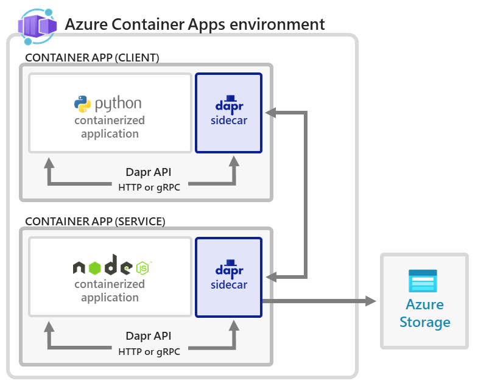

# Demo 2

## Title: Communication between microservices with DAPR in Azure Containers Apps

Demo 2 showcases the communication between two microservices with **DAPR** in Azure Container Apps. 
The application consists of:

- A client (Python) container app to generate messages.
- A service (Node) container app to consume and persist those messages in a state store

.

## Components

- Python App
    - Languages: Python
    - Source code: https://github.com/dapr/quickstarts/tree/master/tutorials/hello-world/python
- Node App
    - Languages: NodeJS
    - Source code: https://github.com/dapr/quickstarts/tree/master/tutorials/hello-world/node

## Deployment

The infrastrcture and apps are deployed using **Bicep** template.

## Source:

Tutorial: https://learn.microsoft.com/en-us/azure/container-apps/microservices-dapr-azure-resource-manager

Application Repository: https://github.com/dapr/quickstarts/tree/master/tutorials/hello-world